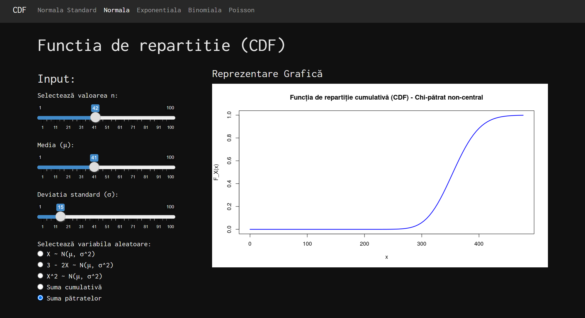
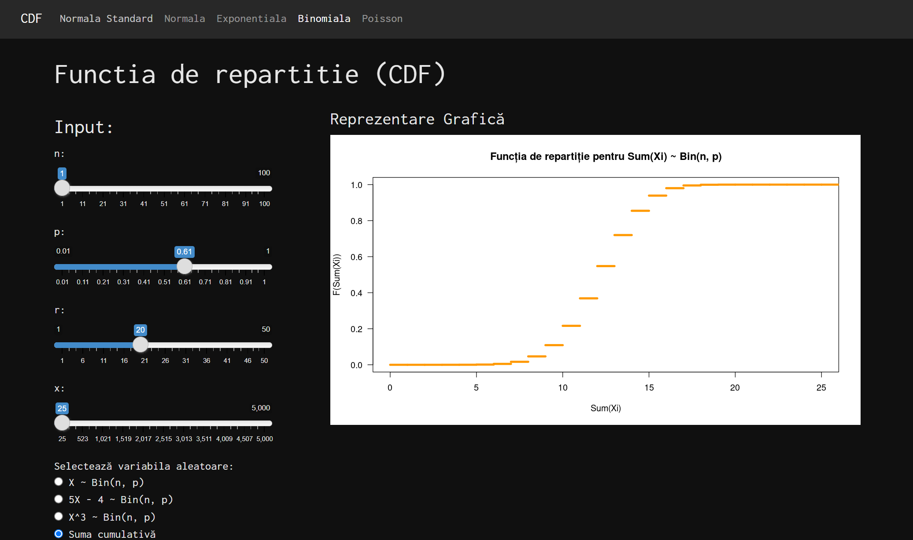

# **Shiny App for Visualizing CDFs**

## **Overview**

This Shiny application provides an interactive tool for visualizing **cumulative distribution functions (CDFs)** of various probability distributions. Users can dynamically adjust parameters and instantly observe changes in the CDF graphs.

### **Supported Distributions**

- 📈 **Normal Distribution**
- ⚡ **Exponential Distribution**
- 🎲 **Binomial Distribution**
- 📊 **Poisson Distribution**

The application offers an intuitive UI with **real-time graph updates**, making it useful for **students, researchers, and data scientists** exploring probability distributions.

## **Features**

✅ Interactive sliders to adjust distribution parameters  
✅ Instant updates of CDF plots  
✅ Multi-tab layout for easy navigation between distributions  
✅ Modular structure for easy customization and extension

## **Screenshots**

  

## **Application Structure**

📌 **Main Components:**

- `app.R` - The entry point that initializes and runs the Shiny application.
- `ui.R` - Defines the **user interface**, organizing selections into tabs.
- `server.R` - Implements **server-side logic**, updating graphs based on user input.
- `utils.R` - Contains **helper functions**, such as graph generation and parameter validation.

📂 **Folder Structure:**

- `server/` - Houses individual scripts for handling each probability distribution separately.
